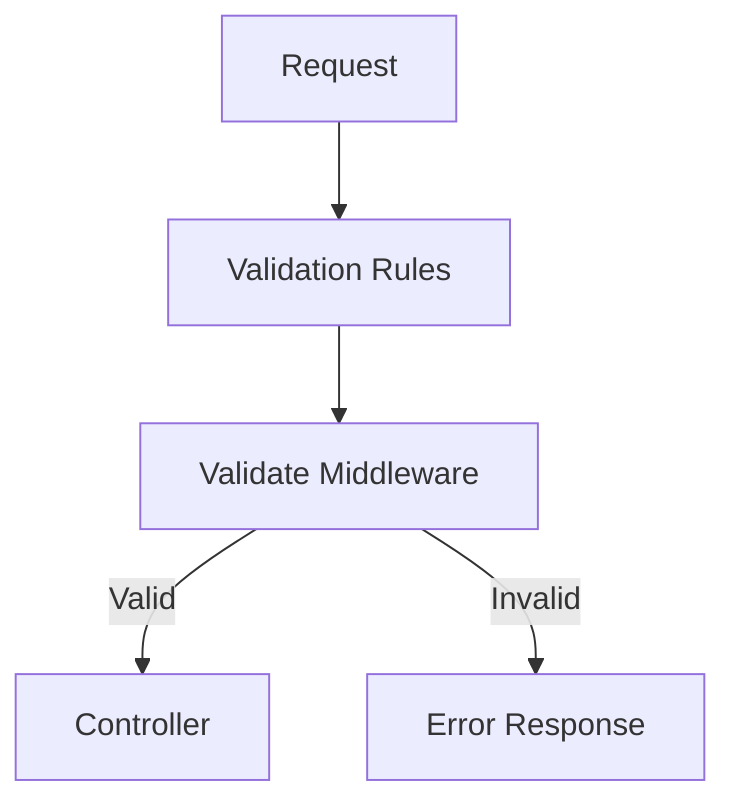

# 📌 Package Management Project - Backend Setup (Continued)

## 🚦 HealthCheck Implementation (v2)

### 🔹 Enhanced HealthCheck Controller
```javascript
import { ApiResponse } from "../utils/api-response.js";

const healthCheck = async (req, res) => {
  try {
    const healthStatus = {
      server: "running",
      timestamp: new Date().toISOString()
    };
    
    res.status(200).json(
      new ApiResponse(200, healthStatus, "Server operational")
    );
  } catch (error) {
    console.error("HealthCheck Error:", error);
    res.status(500).json(
      new ApiResponse(500, null, "Internal Server Error")
    );
  }
};

export { healthCheck };
```

### 📌 Reasoning:  
- **Simple Status:** Basic server status check  
- **Error Handling:** Proper 500 response for errors  
- **Timestamp:** Includes time of check  
- **Async Ready:** Prepared for future async operations  

---

## 🛣️ Route Configuration

### 🔹 HealthCheck Routes
```javascript
import { Router } from "express";
import { healthCheck } from "../controllers/healthcheck.controller.js";

const router = Router();
router.get("/", healthCheck);
export default router;
```

### 🔹 App.js Integration
```javascript
import express from "express";
import healthCheckRouter from "./routes/healthcheck.routes.js";

const app = express();
app.use("/health", healthCheckRouter);
export default app;
```

### 📌 Reasoning:  
- **Simplified Path:** Using `/health` endpoint  
- **Minimal Setup:** Only essential routing  
- **Clear Exports:** Consistent module exports  

---

## Authentication Implementation  

---

## 🔐 Auth Controller Setup

### 🔹 User Registration Controller
```javascript
import { body } from "express-validator";
import { asyncHandler } from "../utils/async-handler.js";

const registerUser = asyncHandler(async (req, res) => {
    const { email, username, password, role } = req.body;
    
    // Validation
    await registrationValidation(body);
    
    // Registration logic will be added here
    // ...
});

export { registerUser };
```

### 📌 Reasoning:  
- **asyncHandler:** Simplifies error handling in async routes  
- **Destructuring:** Clean extraction of user data  
- **Separation of Concerns:** Validation handled separately  
- **Future-Proof:** Ready for registration logic implementation  

---

## ✅ Validation System

### 🔹 Validators Index File
```javascript
import { body } from "express-validator";

const userRegistrationValidator = () => {
  return [
    body("email")
      .trim()
      .notEmpty().withMessage("Email is required")
      .isEmail().withMessage("Email is invalid"),

    body("username")
      .trim()
      .notEmpty().withMessage("Username cannot be empty")
      .isLength({ min: 3 }).withMessage("Username must be at least 3 characters")
      .isLength({ max: 15 }).withMessage("Username cannot exceed 15 characters"),

    body("password")
      .notEmpty().withMessage("Password is required")
      .isLength({ min: 8 }).withMessage("Password must be at least 8 characters")
  ];
};

const userLoginValidator = () => {
  return [
    body("email")
      .isEmail().withMessage("Email is not valid"),
    body("password")
      .notEmpty().withMessage("Password cannot be empty")
  ];
};

export { userRegistrationValidator, userLoginValidator };
```

### 📌 Reasoning:  
- **Chained Validation:** Clear, readable validation rules  
- **Custom Messages:** User-friendly error responses  
- **Security:** Password length requirements  
- **Reusability:** Validators can be used across routes  
- **Consistency:** Standardized validation approach  

---

## 🛠️ Required Packages
```bash
npm install express-validator
```

---

## 🔗 Implementation Flow
1. Request hits route
2. Route uses validator middleware
3. Validator checks input data
4. Controller processes valid data
5. Response sent to client

> **Best Practice:** Always keep validation separate from business logic for cleaner code and easier maintenance.


# 📌 Package Management Project - Backend Setup (Continued)  
## Validation Middleware & Auth Routes  


## 🛡️ Validation Middleware

### 🔹 Validator Middleware Implementation
```javascript
import { validationResult } from "express-validator";
import ApiError from "../utils/api-error.js";

export const validate = (req, res, next) => {
    const errors = validationResult(req);

    if(errors.isEmpty()){
        return next();
    }

    const extractedErrors = errors.array().map((err) => ({
        [err.path]: err.msg
    }));

    throw new ApiError(422, "Received data is not valid", extractedErrors);
};
```

### 📌 Reasoning:  
- **Centralized Validation:** Handles all validation errors consistently  
- **Structured Errors:** Formats errors as { field: message } pairs  
- **Proper Status Code:** Uses 422 (Unprocessable Entity) for validation failures  
- **Error Standardization:** Leverages custom ApiError class  
- **Early Termination:** Stops request processing on validation failure  

---

## 🛣️ Auth Route Implementation

### 🔹 User Registration Route
```javascript
import { Router } from "express";
import { registerUser } from "../controllers/auth.controllers.js";
import { validate } from "../middlewares/validators.middleware.js";
import { userRegistrationValidator } from "../validators/index.js";

const router = Router();

router.post(
    "/register", 
    userRegistrationValidator(), // Validation rules
    validate,                   // Validation middleware
    registerUser                // Controller
);

export default router;
```

### 📌 Reasoning:  
- **Middleware Chaining:** Clear flow of validation → processing  
- **Factory Pattern:** `userRegistrationValidator()` executes to return middleware array  
- **Explicit Imports:** All imports include .js extensions  
- **RESTful Design:** Proper POST method for registration  
- **Separation of Concerns:** Route only handles routing logic  

---

## 🔄 Complete Request Flow
1. **Request Received** at `/api/v1/auth/register`
2. **Validation Rules Applied** via `userRegistrationValidator()`
3. **Validation Checked** by `validate` middleware
4. **If Valid** → Proceeds to `registerUser` controller
5. **If Invalid** → Throws standardized 422 error



---

## 🏷️ Error Response Example
```json
{
    "statusCode": 422,
    "message": "Received data is not valid",
    "errors": [
        { "email": "Email is invalid" },
        { "password": "Password must be at least 8 characters" }
    ],
    "success": false
}
```

> **Best Practice:** This middleware pattern can be reused across all routes requiring validation, ensuring consistent error handling throughout your API.


